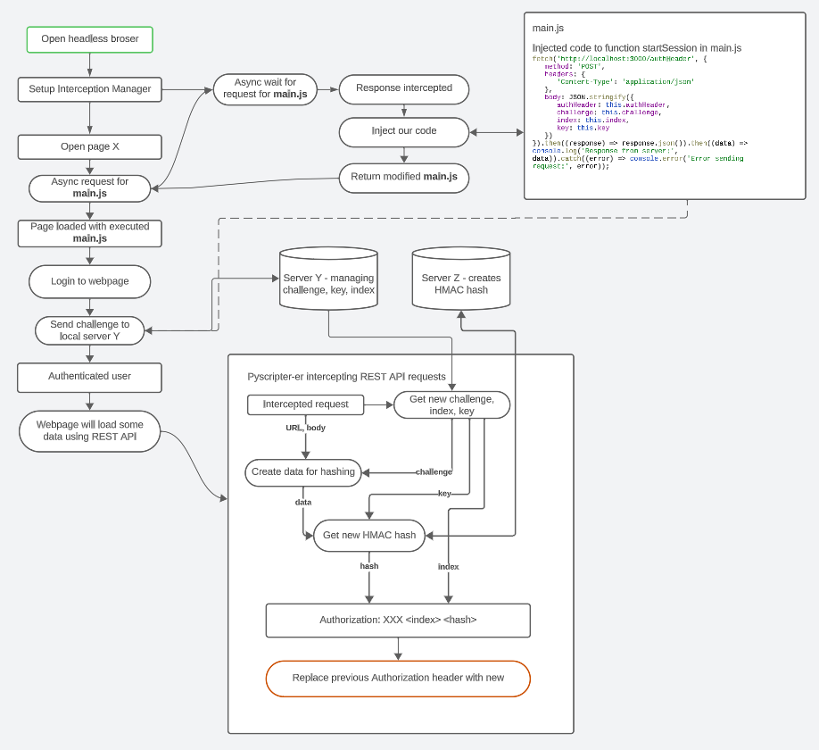

### Requirements

```
pip install Flask
pip install python-secrets
npm i
```

### How to run
Copy .env configuration to root of project

```
PROXY_SERVER = localhost:8080
URL_JS_SCRIPT_TO_INJECT = https://YOUR_PAGE/JS_SCRIPT_PATH
LOCALHOST_CHALLENGE_SERVER = http://localhost:3000
BASE_PAGE = https://YOUR_PAGE
```

`npm run all` - should start everything

PS: Happy hacking :)


### How does it work?
